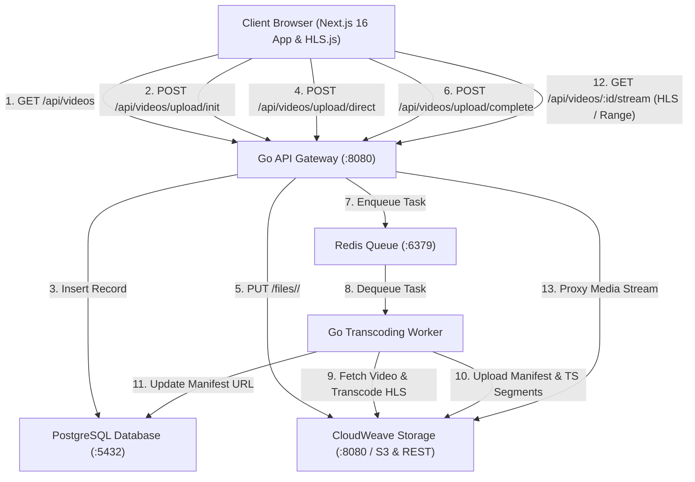

# Streamify

Streamify is a distributed video streaming and processing platform designed to simulate modern media pipeline architecture. The application combines a responsive Next.js web application with a high performance Go backend API, background video transcoding workers, PostgreSQL database persistence, Redis queue management, and CloudWeave object storage.

## System Architecture Diagram



## Video Processing Flowchart

```mermaid
flowchart LR
    subgraph Ingestion
        A[User Selects Video] --> B[Initialize Upload Record]
        B --> C[Stream Upload via Direct Proxy]
        C --> D[Store in CloudWeave raw-uploads]
    end

    subgraph Processing
        D --> E[Enqueue Redis Transcode Task]
        E --> F[Go Worker Executes FFmpeg / Transcoding]
        F --> G[Upload HLS .m3u8 & .ts Segments to CloudWeave]
    end

    subgraph Serving
        G --> H[Update PostgreSQL Manifest URL]
        H --> I[Stream via /api/videos/:id/stream Proxy]
        I --> J[Adaptive Bitrate Playback with HLS.js]
    end
```



## Architecture Overview

The system consists of three main operational layers:

1. Frontend Application
   Built with Next.js 16, React 19, TypeScript, and HLS.js. It features a custom YouTube-style video player with interactive timeline scrubbing, video quality selection, adaptive bitrate streaming, live video feed filtering, and simulated pipeline upload controls.

2. Backend API Gateway
   Developed in Go using the Gin framework. It manages REST endpoints, connects with PostgreSQL for metadata persistence, handles high-throughput direct streaming uploads to CloudWeave, serves chunked byte-range video streams, and manages video deletion operations.

3. Background Worker and Processing Pipeline
   A Go worker service powered by Redis Asynq. It handles asynchronous background transcoding, HLS segmentation, and CloudWeave object storage synchronization.

## Technology Stack

- Web Client: Next.js 16, React 19, Tailwind CSS, TypeScript, HLS.js
- API Server: Go, Gin Web Framework
- Worker Queue: Go, Redis Asynq
- Database: PostgreSQL 16
- Storage: CloudWeave Object Storage (S3 Compatible & Native REST)
- Cache and Message Broker: Redis 7
- Authentication: Better Auth

## Repository Structure

```text
YTStream/
├── backend/
│   ├── api/
│   │   └── main.go           # REST API Gateway & streaming proxy
│   ├── worker/
│   │   └── main.go           # Redis Asynq background transcode worker
│   └── db/
│       └── schema.sql        # Database schema definitions
├── src/
│   ├── app/
│   │   ├── page.tsx          # Main video feed page
│   │   ├── upload/page.tsx   # Video upload pipeline page
│   │   ├── watch/[id]/page.tsx # Video player with HLS.js playback
│   │   └── login/page.tsx    # User login page
│   ├── components/           # Reusable UI elements
│   ├── hooks/                # Custom React hooks
│   └── lib/                  # API and authentication clients
└── docker-compose.yml        # Infrastructure container configuration
```

## Getting Started

### Prerequisites

Ensure the following tools are installed on your environment:
- Node.js version 18.0 or higher
- Go version 1.22 or higher
- Docker and Docker Compose
- FFmpeg (optional, recommended for adaptive HLS transcoding)

### 1. Start Infrastructure Services

Spin up PostgreSQL and Redis containers using Docker Compose:

```bash
docker-compose up -d
```

This starts:
- PostgreSQL on port 5432
- Redis on port 6379

### 2. Start CloudWeave Object Storage

Run CloudWeave natively in its standalone directory (default port: 8080 or 9000):

```bash
go run cmd/node/main.go -port 9000 -data ./data -api-keys "cw_key_streamify=admin"
```

### 3. Start the Backend API Server

Navigate to the API directory and run the Go server:

```bash
cd backend/api
go run main.go
```

The API gateway will start listening on http://localhost:8080.

### 4. Start the Background Worker Daemon

Open a new terminal window, navigate to the worker directory, and start the worker:

```bash
cd backend/worker
go run main.go
```

### 5. Start the Frontend Application

In another terminal window, install frontend dependencies and start the Next.js development server:

```bash
npm install
npm run dev
```

Open http://localhost:3000 in your browser to access the application.

## Core Features

- Direct Streaming Uploads: Streams video binaries directly into CloudWeave via backend proxy to bypass browser CORS and SigV4 signature restrictions.
- Adaptive HLS Playback: Decodes multi-variant HLS streams (`.m3u8` and `.ts`) via HLS.js with automatic fallback to MP4.
- HTTP Byte-Range Streaming: Supports seeking and instant chunked playback through `/api/videos/:id/stream`.
- Video Metadata Persistence: Stores video records and user associations in PostgreSQL.
- Interactive Video Player: Features a custom player with a timeline progress bar, hover previews, quality selector, and native playback controls.
- Asynchronous Processing: Uses Redis task queues to offload background video processing tasks.
- Content Management: Allows permanent deletion of video metadata and associated storage assets.

## API Documentation

- GET /api/videos: Returns all public video metadata records.
- GET /api/videos/:id: Returns metadata for a specific video by ID.
- GET /api/videos/:id/stream: Proxies video streams or HLS playlists with HTTP Range header support.
- GET /api/videos/:id/status: Returns current transcoding job status and progress percentage.
- POST /api/videos/upload/init: Initializes a video record and reserves storage object keys.
- POST /api/videos/upload/direct: Accepts multipart video payload and streams directly to CloudWeave storage.
- POST /api/videos/upload/complete: Enqueues a transcoding task in Redis Asynq upon upload completion.
- DELETE /api/videos/:id: Deletes a video record from the database and removes storage objects.

