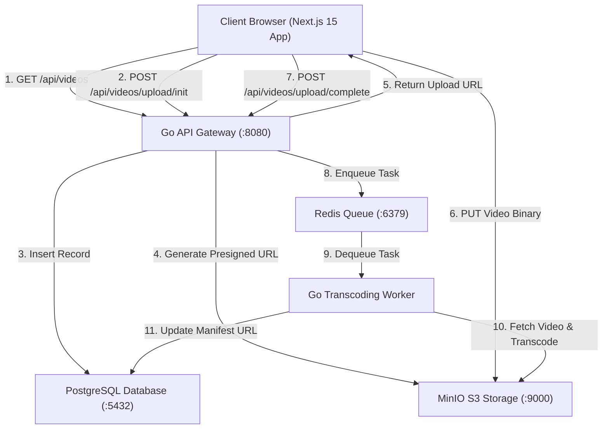
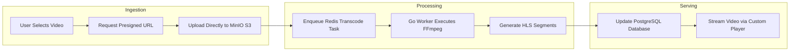

# Streamify

Streamify is a distributed video streaming and processing platform designed to simulate modern media pipeline architecture. The application combines a responsive Next.js web application with a high performance Go backend API, background video transcoding workers, PostgreSQL database persistence, Redis queue management, and MinIO object storage.

## System Architecture Diagram



## Video Processing Flowchart



## Architecture Overview

The system consists of three main operational layers:

1. Frontend Application
   Built with Next.js 15, React 19, and TypeScript. It features a custom YouTube-style video player with interactive timeline scrubbing, video quality selection, live video feed filtering, and simulated pipeline upload controls.

2. Backend API Gateway
   Developed in Go using the Gin framework. It manages REST endpoints, connects with PostgreSQL for metadata persistence, issues MinIO presigned S3 URLs for direct client uploads, and manages video deletion operations.

3. Background Worker and Processing Pipeline
   A Go worker service powered by Redis Asynq. It handles asynchronous background transcoding, HLS segmentation, and object storage management.

## Technology Stack

- Web Client: Next.js 15, React 19, Tailwind CSS, TypeScript
- API Server: Go, Gin Web Framework
- Worker Queue: Go, Redis Asynq
- Database: PostgreSQL 16
- Storage: MinIO Object Storage (AWS S3 Compatible)
- Cache and Message Broker: Redis 7
- Authentication: Better Auth

## Repository Structure

```text
YTStream/
├── backend/
│   ├── api/
│   │   └── main.go           # REST API Gateway implementation
│   ├── worker/
│   │   └── main.go           # Redis Asynq background worker
│   └── db/
│       └── schema.sql        # Database schema definitions
├── src/
│   ├── app/
│   │   ├── page.tsx          # Main video feed page
│   │   ├── upload/page.tsx   # Video upload pipeline page
│   │   ├── watch/[id]/page.tsx # Video player and telemetry page
│   │   └── login/page.tsx    # User login page
│   ├── components/           # Reusable UI elements
│   ├── hooks/                # Custom React hooks
│   └── lib/                  # API and authentication clients
└── docker-compose.yml        # Infrastructure container configuration
```

## Getting Started

### Prerequisites

Ensure the following tools are installed on your environment:
- Node.js version 18.0 or higher
- Go version 1.22 or higher
- Docker and Docker Compose

### 1. Start Infrastructure Services

Spin up PostgreSQL, Redis, and MinIO containers using Docker Compose:

```bash
docker-compose up -d
```

This starts the required services:
- PostgreSQL on port 5432
- Redis on port 6379
- MinIO Object Storage on port 9000 (Console on 9001)

### 2. Start the Backend API Server

Navigate to the API directory and run the Go server:

```bash
cd backend/api
go run main.go
```

The API gateway will start listening on http://localhost:8080.

### 3. Start the Background Worker Daemon

Open a new terminal window, navigate to the worker directory, and start the daemon:

```bash
cd backend/worker
go run main.go
```

### 4. Start the Frontend Application

In another terminal window, install frontend dependencies and start the Next.js development server:

```bash
npm install
npm run dev
```

Open http://localhost:3000 in your browser to access the application.

## Core Features

- Direct S3 Uploads: Uploads video binaries directly to MinIO storage using presigned URLs.
- Video Metadata Persistence: Stores video records and user associations in PostgreSQL.
- Interactive Video Player: Features a custom player with a timeline progress bar, hover time previews, play and pause controls, and resolution selectors.
- Asynchronous Processing: Uses Redis task queues to offload background video processing tasks.
- Content Management: Allows permanent deletion of video metadata and associated storage assets.

## API Documentation

- GET /api/videos: Returns all public video metadata records.
- GET /api/videos/:id: Returns metadata for a specific video by ID.
- POST /api/videos/upload/init: Initializes a video record and returns a MinIO presigned URL.
- POST /api/videos/upload/complete: Enqueues a transcoding task upon upload completion.
- DELETE /api/videos/:id: Deletes a video record from the database and removes storage objects.
